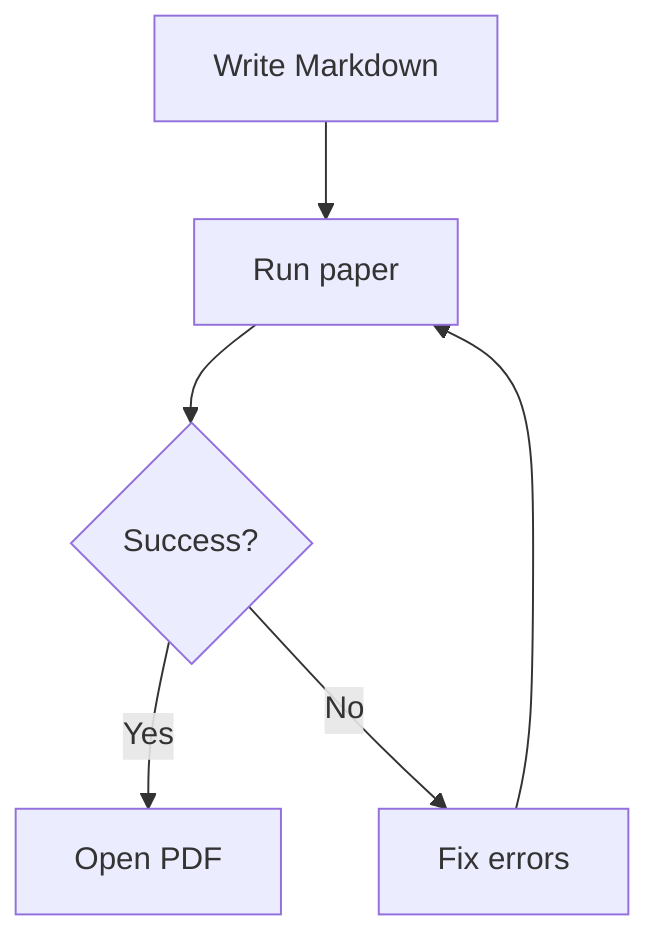
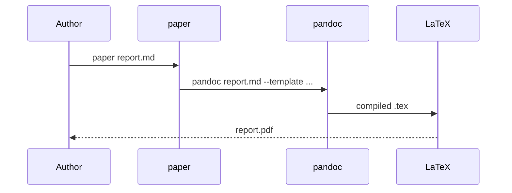

\begin{center}
{\Huge The Paper Project}

\vspace{0.25em}
{\large --- Sahu, S}
\end{center}

Paper is the truest form of a document, physical, permanent, and universally readable. 'The Paper Project' brings together Markdown and LaTeX with diagrams, formulae, and rich formatting and renders the result as a PDF.

## Overview

`paper` takes a Markdown file and renders it as a styled PDF via a Docker container. It handles:

- Custom LaTeX template with section-aware headers and page numbers
- Emoji rendering (unicode → SVG via twemoji)
- Mermaid diagrams (rendered via headless Chrome)
- Toggles for page numbers and section page breaks

## Requirements

- Docker
- The `paper:latest` image built from this directory

```sh
docker build -t paper:latest .
```

## Usage

```sh
paper <file.md> [options]
```

| Option | Description |
|---|---|
| `--pages=yes` | Show page numbers (default) |
| `--pages=no` | Hide page numbers |
| `--continuous` | No page break between sections |
| `-v`, `--verbose` | Print commands as they run |

After the PDF is generated it opens automatically. You are then prompted whether to keep or delete it.

### Examples

```sh
# Basic
paper report.md

# No page numbers
paper report.md --pages=no

# No section breaks, no page numbers
paper report.md --continuous --pages=no
```

## Mermaid diagrams

Mermaid code blocks are rendered as diagrams in the PDF.

````markdown

````



## Front matter variables

Set these in your document's YAML front matter to control layout:

```yaml
---
title: My Report
author: Your Name
date: 2026-06-13
continuous-pages: true   # no page breaks between sections
no-page-numbers: true    # hide page numbers
---
```

## Acknowledgements

`emoji_filter.js` is based on work by [Miguel Angelo](https://github.com/nicholasgasior), originally licensed under the [Apache License 2.0](https://www.apache.org/licenses/LICENSE-2.0). It converts unicode emoji in Markdown to SVG images (via twemoji or noto-emoji) so they render correctly in the PDF output.

`pandoc-emoji-filter.js` is derived from [masbicudo/Pandoc-Emojis-Filter](https://github.com/masbicudo/Pandoc-Emojis-Filter), modified to suit this project. It preprocesses Markdown by replacing unicode emoji with local SVG image references before the document is passed to pandoc.

