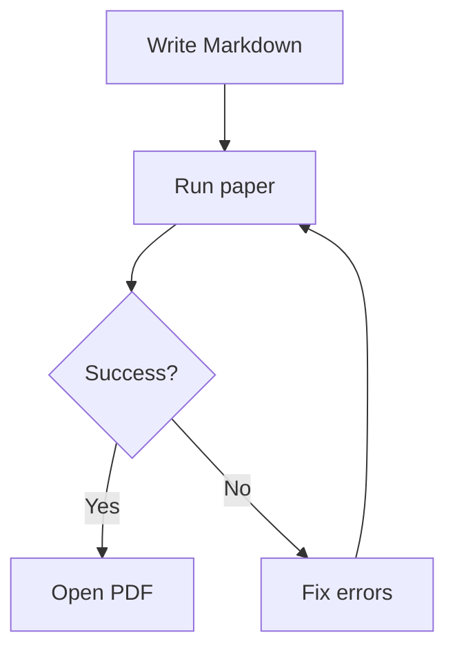
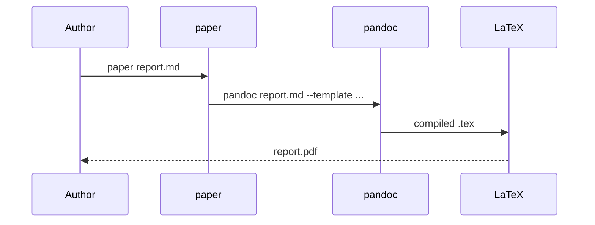

\begin{center}
{\Huge The Paper Project}

\vspace{0.25em}
{\large --- Sahu, S}
\end{center}

Paper is the truest form of a document, physical, permanent, and universally readable. 'The Paper Project' brings together Markdown and LaTeX with diagrams, formulae, and rich formatting and renders the result as a PDF.

## Overview

`paper` takes a Markdown file and renders it as a styled PDF via a Docker container. It handles:

- Custom LaTeX template with section-aware headers and page numbers
- Emoji rendering (unicode → SVG via twemoji)
- Mermaid diagrams (rendered via headless Chrome)
- Toggles for page numbers and section page breaks

## Requirements

- Docker

## Installation

Clone the repo and build the Docker image:

```sh
git clone <repo-url> $HOME/paper
cd $HOME/paper
docker build -t paper:latest .
```

Or pull the prebuilt image instead of building. It supports every feature,
mermaid included (~460 MB, `linux/amd64`):

```sh
docker pull ghcr.io/mrsauravsahu/paper:latest
docker tag ghcr.io/mrsauravsahu/paper:latest paper:latest
```

The script expects the image tagged `paper:latest` locally. If you want the
smaller mermaid-free image, build it yourself — see below.

Then symlink the `paper` script into a directory on your `$PATH`:

```sh
ln -sf $HOME/paper/paper $HOME/.local/bin/paper
```

### What is in the image

The image is assembled from components rather than a prebuilt pandoc/TeX base,
in four stages:

| Component | Source | Why |
|---|---|---|
| `pandoc` | upstream `.deb` release | Markdown → LaTeX |
| `pdflatex` | TeX Live `scheme-infraonly` + only the packages `config/template.tex` loads | LaTeX → PDF |
| `node` + `node_modules` | official node image, `npm ci --omit=dev` | the pandoc filters in `src/` |
| `rsvg-convert` | Debian `librsvg2-bin` | emoji SVG → PDF |

That default image is about 460 MB, most of which is the chromium needed to
rasterise mermaid diagrams. Drop it for a ~220 MB image if you never use them:

```sh
docker build --build-arg WITH_CHROMIUM=0 -t paper:latest .
```

Only documents containing mermaid code blocks are affected. The `paper` script
loads the mermaid filter only when the document actually contains such a block,
so a chromium-free build renders everything else normally.

### Publishing the image

Images are published on tags only — merging to `main` pushes nothing. Tagging
`v0.1.0` publishes:

| Tag | Contents |
|---|---|
| `ghcr.io/mrsauravsahu/paper:0.1.0` | full image, mermaid included |
| `ghcr.io/mrsauravsahu/paper:latest` | moved to that same full image |

`linux/amd64` only: one CI job runs on one architecture, and emulating arm64
under QEMU would take 30-60 minutes for this image. Apple Silicon runs the
amd64 image fine under Docker Desktop, or build locally for a native one.

```sh
git tag v0.1.0
git push origin v0.1.0
```

To publish by hand instead:

```sh
docker build -t ghcr.io/mrsauravsahu/paper:latest .
docker push ghcr.io/mrsauravsahu/paper:latest
```

For Docker Hub, retag to `<user>/paper:latest` and push to that instead.

## Usage

```sh
paper <file.md> [options]
```

| Option | Description |
|---|---|
| `--pages=yes` | Show page numbers (default) |
| `--pages=no` | Hide page numbers |
| `--continuous` | No page break between sections |
| `-o`, `--output <file.pdf>` | Write PDF to this path (default: temp dir, opened automatically) |
| `-v`, `--verbose` | Print commands as they run |

After the PDF is generated it opens automatically. You are then prompted whether to keep or delete it.

### Examples

```sh
# Basic
paper report.md

# No page numbers
paper report.md --pages=no

# No section breaks, no page numbers
paper report.md --continuous --pages=no

# Save PDF to a specific path
paper report.md -o ~/Documents/report.pdf
```

## Mermaid diagrams

Mermaid code blocks are rendered as diagrams in the PDF.

````markdown

```mermaid
graph TD
    A[Write Markdown] --> B[Run paper]
    B --> C{Success?}
    C -- Yes --> D[Open PDF]
    C -- No --> E[Fix errors]
    E --> B
```
````


```mermaid
sequenceDiagram
    participant Author
    participant paper
    participant pandoc
    participant LaTeX

    Author->>paper: paper report.md
    paper->>pandoc: pandoc report.md --template ...
    pandoc->>LaTeX: compiled .tex
    LaTeX-->>Author: report.pdf
```

## Front matter variables

Set these in your document's YAML front matter to control layout:

```yaml
---
title: My Report
author: Your Name
date: 2026-06-13
continuous-pages: true   # no page breaks between sections
no-page-numbers: true    # hide page numbers
---
```

## Acknowledgements

`src/emoji-filter.js` is based on work by [Miguel Angelo](https://github.com/nicholasgasior), originally licensed under the [Apache License 2.0](https://www.apache.org/licenses/LICENSE-2.0). It converts unicode emoji in Markdown to SVG images (via twemoji or noto-emoji) so they render correctly in the PDF output.

`src/pandoc-emoji-filter.js` is derived from [masbicudo/Pandoc-Emojis-Filter](https://github.com/masbicudo/Pandoc-Emojis-Filter), modified to suit this project. It preprocesses Markdown by replacing unicode emoji with local SVG image references before the document is passed to pandoc.

