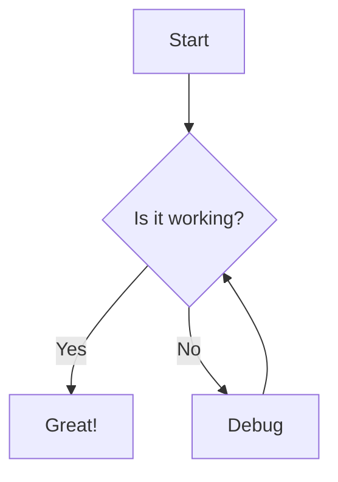
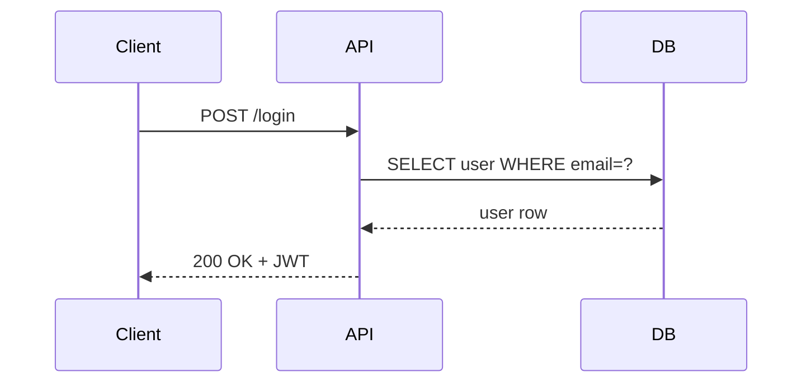
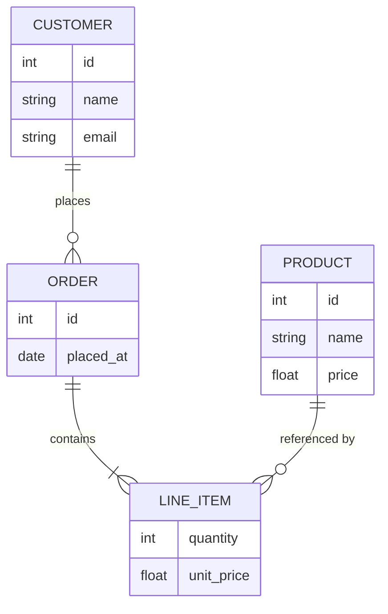
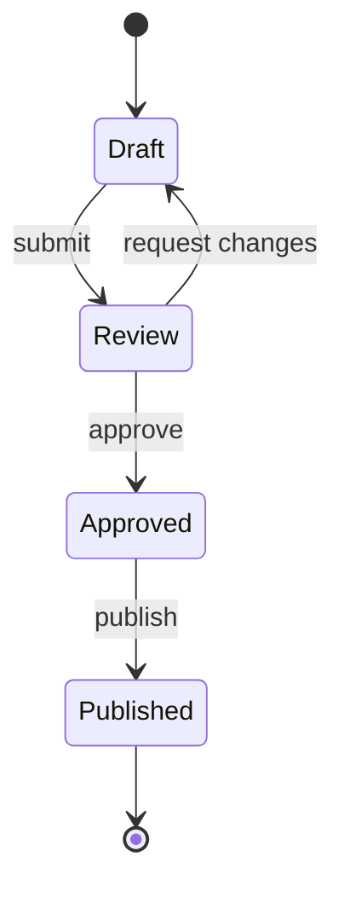
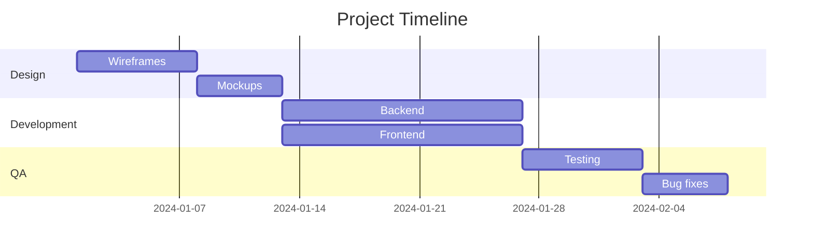
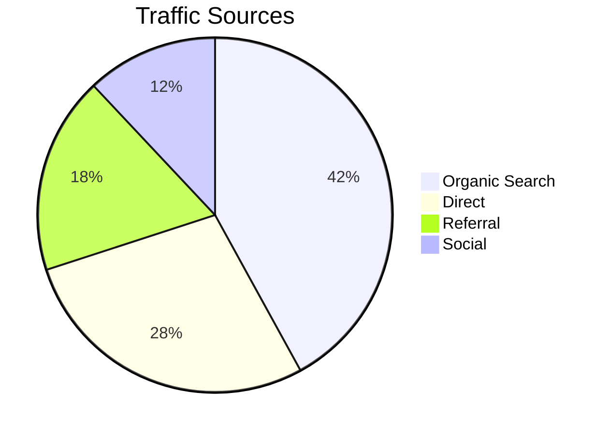
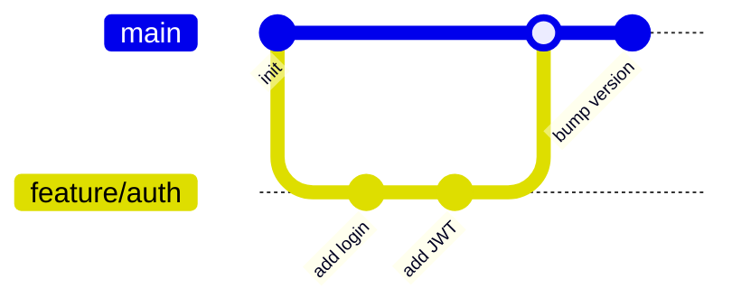

\begin{center}
{\Huge Mermaid Diagram Samples}

\vspace{0.5em}
{\large the paper project}

\vspace{0.25em}
{\large --- Sahu, S}
\end{center}

# Alignment

Text alignment uses raw LaTeX fences. Wrap any block in `\begin{center}` /
`\end{center}`, `\begin{flushleft}` / `\end{flushleft}`, or
`\begin{flushright}` / `\end{flushright}`.

**Center:**

\begin{center}
This line is centered.
\end{center}

**Right-align:**

\begin{flushright}
This line is right-aligned.
\end{flushright}

**Left-align (overrides justify):**

\begin{flushleft}
This line is left-aligned.
\end{flushleft}

Individual inline text can be nudged with `\hfill` to push content to the right
edge of the line: left side \hfill right side

# Flowchart

# Sequence Diagram

# Entity Relationship

# State Diagram

# Gantt Chart

# Pie Chart

# Git Graph

