# Mermaid Comprehensive Diagram Test

This file exercises every major Mermaid diagram type to verify rendering support.

---

## 1. Flowchart (TD)

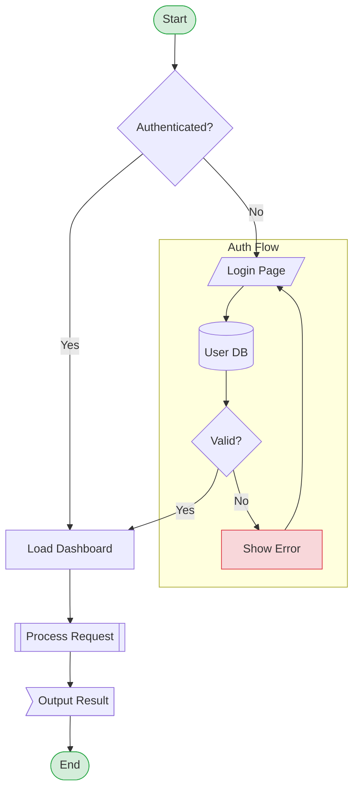
```mermaid
flowchart TD
    A([Start]) --> B{Authenticated?}
    B -- Yes --> C[Load Dashboard]
    B -- No --> D[/Login Page/]
    D --> E[(User DB)]
    E --> F{Valid?}
    F -- Yes --> C
    F -- No --> G[Show Error]
    G --> D
    C --> H[[Process Request]]
    H --> I>Output Result]
    I --> J([End])

    subgraph Auth Flow
        D
        E
        F
        G
    end

    style A fill:#d4edda,stroke:#28a745
    style J fill:#d4edda,stroke:#28a745
    style G fill:#f8d7da,stroke:#dc3545
```

## 2. Flowchart (LR)

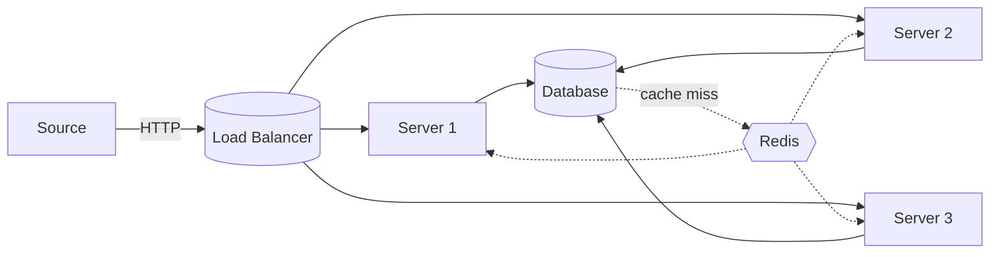
```mermaid
flowchart LR
    src[Source] -->|HTTP| lb[(Load Balancer)]
    lb --> s1[Server 1]
    lb --> s2[Server 2]
    lb --> s3[Server 3]
    s1 & s2 & s3 --> db[(Database)]
    db -.->|cache miss| cache{{Redis}}
    cache -.-> s1 & s2 & s3
```

## 3. Sequence Diagram

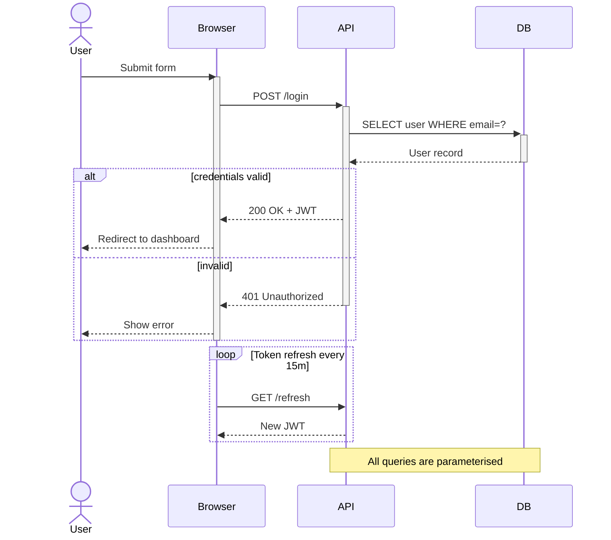
```mermaid
sequenceDiagram
    actor User
    participant Browser
    participant API
    participant DB

    User->>Browser: Submit form
    activate Browser
    Browser->>+API: POST /login
    API->>+DB: SELECT user WHERE email=?
    DB-->>-API: User record
    alt credentials valid
        API-->>Browser: 200 OK + JWT
        Browser-->>User: Redirect to dashboard
    else invalid
        API-->>-Browser: 401 Unauthorized
        Browser-->>User: Show error
    end
    deactivate Browser

    loop Token refresh every 15m
        Browser->>API: GET /refresh
        API-->>Browser: New JWT
    end

    Note over API,DB: All queries are parameterised
```

## 4. Class Diagram

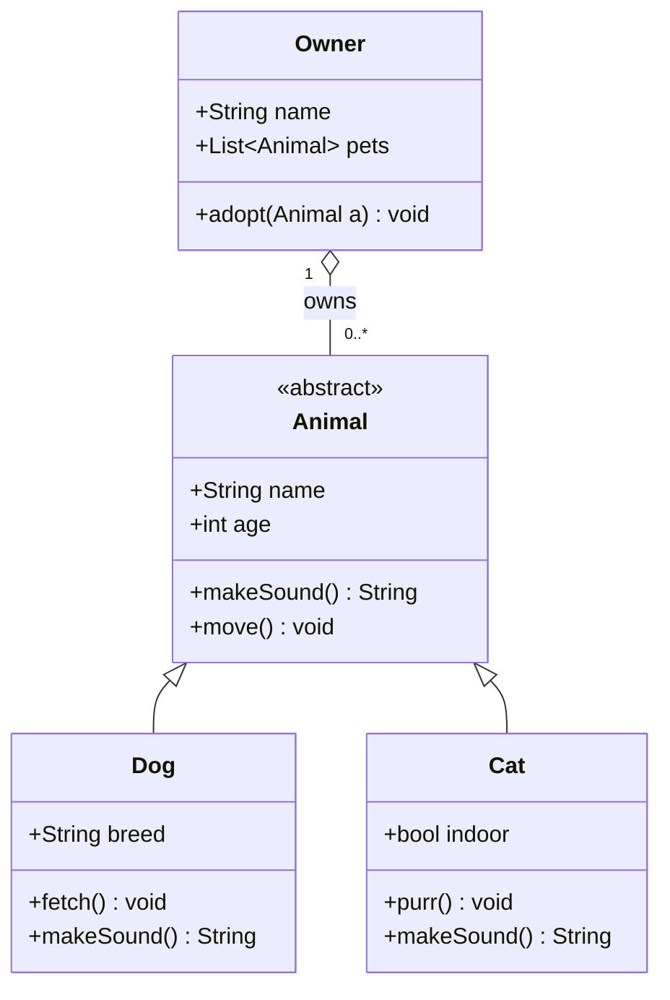
```mermaid
classDiagram
    direction TB

    class Animal {
        <<abstract>>
        +String name
        +int age
        +makeSound() String
        +move() void
    }

    class Dog {
        +String breed
        +fetch() void
        +makeSound() String
    }

    class Cat {
        +bool indoor
        +purr() void
        +makeSound() String
    }

    class Owner {
        +String name
        +List~Animal~ pets
        +adopt(Animal a) void
    }

    Animal <|-- Dog
    Animal <|-- Cat
    Owner "1" o-- "0..*" Animal : owns
```

## 5. State Diagram

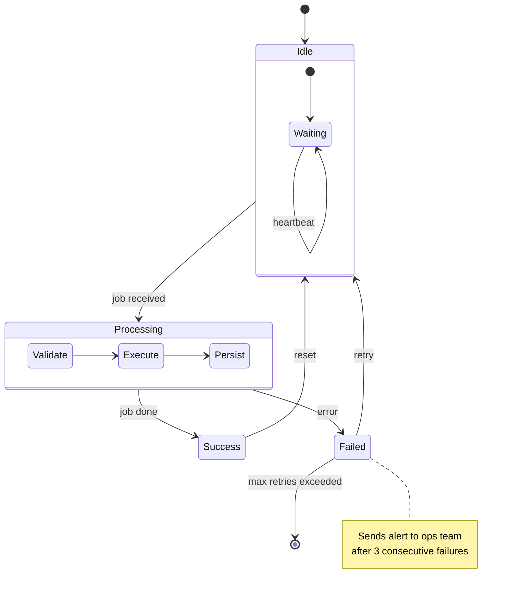
```mermaid
stateDiagram-v2
    [*] --> Idle

    state Idle {
        [*] --> Waiting
        Waiting --> Waiting : heartbeat
    }

    Idle --> Processing : job received
    Processing --> Success : job done
    Processing --> Failed : error

    state Processing {
        direction LR
        Validate --> Execute
        Execute --> Persist
    }

    Success --> Idle : reset
    Failed --> Idle : retry
    Failed --> [*] : max retries exceeded

    note right of Failed
        Sends alert to ops team
        after 3 consecutive failures
    end note
```

## 6. Entity Relationship Diagram

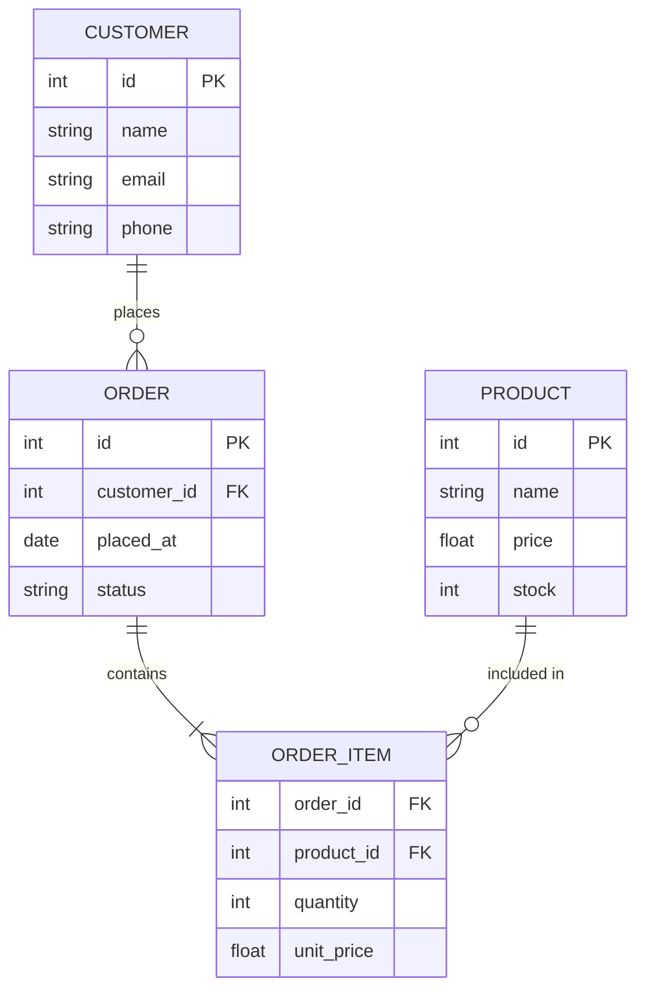
```mermaid
erDiagram
    CUSTOMER ||--o{ ORDER : places
    CUSTOMER {
        int id PK
        string name
        string email
        string phone
    }
    ORDER ||--|{ ORDER_ITEM : contains
    ORDER {
        int id PK
        int customer_id FK
        date placed_at
        string status
    }
    PRODUCT ||--o{ ORDER_ITEM : "included in"
    PRODUCT {
        int id PK
        string name
        float price
        int stock
    }
    ORDER_ITEM {
        int order_id FK
        int product_id FK
        int quantity
        float unit_price
    }
```

## 7. Gantt Chart

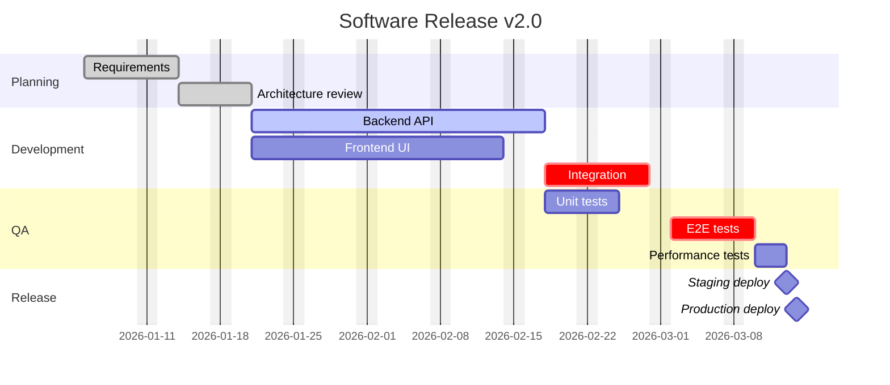
```mermaid
gantt
    title Software Release v2.0
    dateFormat YYYY-MM-DD
    excludes weekends

    section Planning
    Requirements         :done,    req,  2026-01-05, 7d
    Architecture review  :done,    arch, after req,  5d

    section Development
    Backend API          :active,  be,   after arch, 20d
    Frontend UI          :         fe,   after arch, 18d
    Integration          :crit,    int,  after be,   8d

    section QA
    Unit tests           :         ut,   after be,   5d
    E2E tests            :crit,    e2e,  after int,  6d
    Performance tests    :         perf, after e2e,  3d

    section Release
    Staging deploy       :milestone, m1, after perf, 0d
    Production deploy    :milestone, m2, 2026-03-14, 0d
```

## 8. Pie Chart

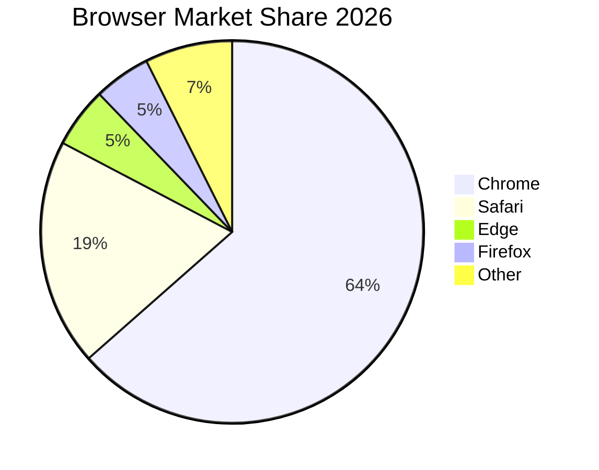
```mermaid
pie title Browser Market Share 2026
    "Chrome"   : 63.5
    "Safari"   : 19.2
    "Edge"     : 5.1
    "Firefox"  : 4.8
    "Other"    : 7.4
```

## 9. Git Graph

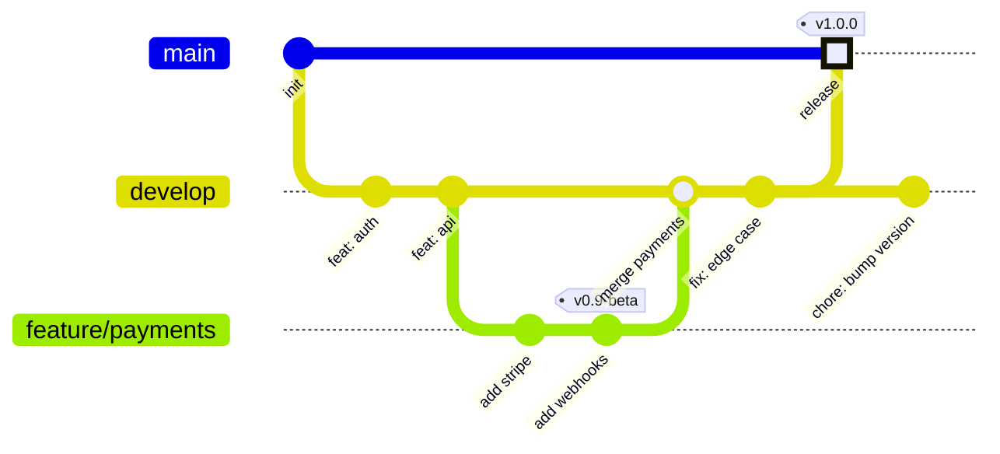
```mermaid
gitGraph LR:
    commit id: "init"
    branch develop
    checkout develop
    commit id: "feat: auth"
    commit id: "feat: api"
    branch feature/payments
    checkout feature/payments
    commit id: "add stripe"
    commit id: "add webhooks" tag: "v0.9-beta"
    checkout develop
    merge feature/payments id: "merge payments"
    commit id: "fix: edge case"
    checkout main
    merge develop id: "release" tag: "v1.0.0" type: HIGHLIGHT
    checkout develop
    commit id: "chore: bump version"
```

## 10. User Journey

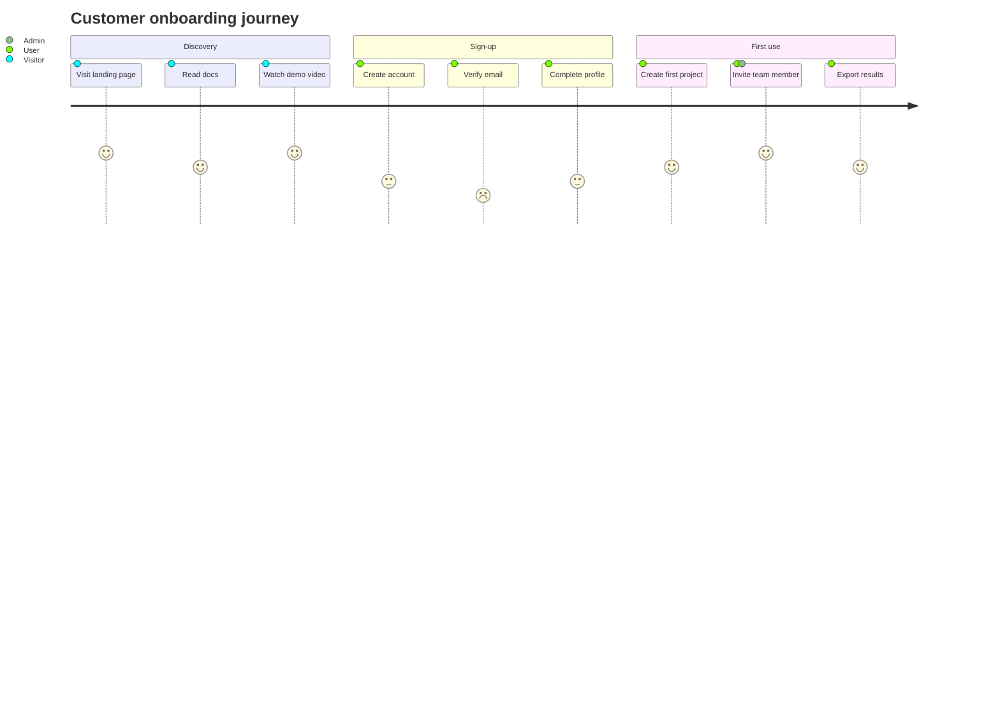
```mermaid
journey
    title Customer onboarding journey
    section Discovery
        Visit landing page : 5 : Visitor
        Read docs          : 4 : Visitor
        Watch demo video   : 5 : Visitor
    section Sign-up
        Create account     : 3 : User
        Verify email       : 2 : User
        Complete profile   : 3 : User
    section First use
        Create first project : 4 : User
        Invite team member   : 5 : User, Admin
        Export results       : 4 : User
```

## 11. Quadrant Chart

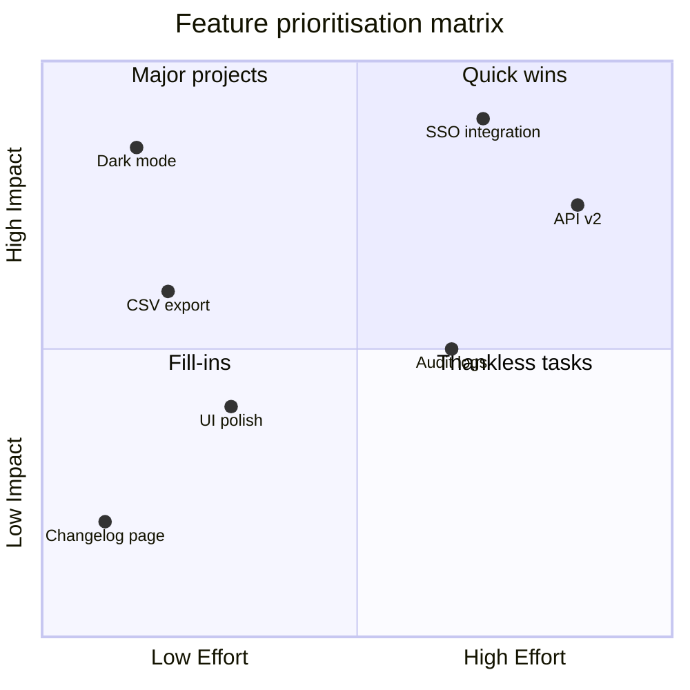
```mermaid
quadrantChart
    title Feature prioritisation matrix
    x-axis Low Effort --> High Effort
    y-axis Low Impact --> High Impact
    quadrant-1 Quick wins
    quadrant-2 Major projects
    quadrant-3 Fill-ins
    quadrant-4 Thankless tasks
    Dark mode: [0.15, 0.85]
    SSO integration: [0.7, 0.9]
    UI polish: [0.3, 0.4]
    CSV export: [0.2, 0.6]
    API v2: [0.85, 0.75]
    Changelog page: [0.1, 0.2]
    Audit logs: [0.65, 0.5]
```

## 12. Requirement Diagram

```mermaid
requirementDiagram
    requirement user_auth {
        id: REQ-001
        text: System shall authenticate users via email and password
        risk: high
        verifymethod: test
    }

    functionalRequirement mfa {
        id: REQ-002
        text: System shall support TOTP-based MFA
        risk: medium
        verifymethod: test
    }

    performanceRequirement response_time {
        id: REQ-003
        text: Login endpoint shall respond within 300ms at p99
        risk: medium
        verifymethod: demonstration
    }

    element AuthService {
        type: component
        docref: docs/auth-service.md
    }

    AuthService - satisfies -> user_auth
    AuthService - satisfies -> mfa
    AuthService - satisfies -> response_time
    mfa - refines -> user_auth
```

## 13. Mindmap

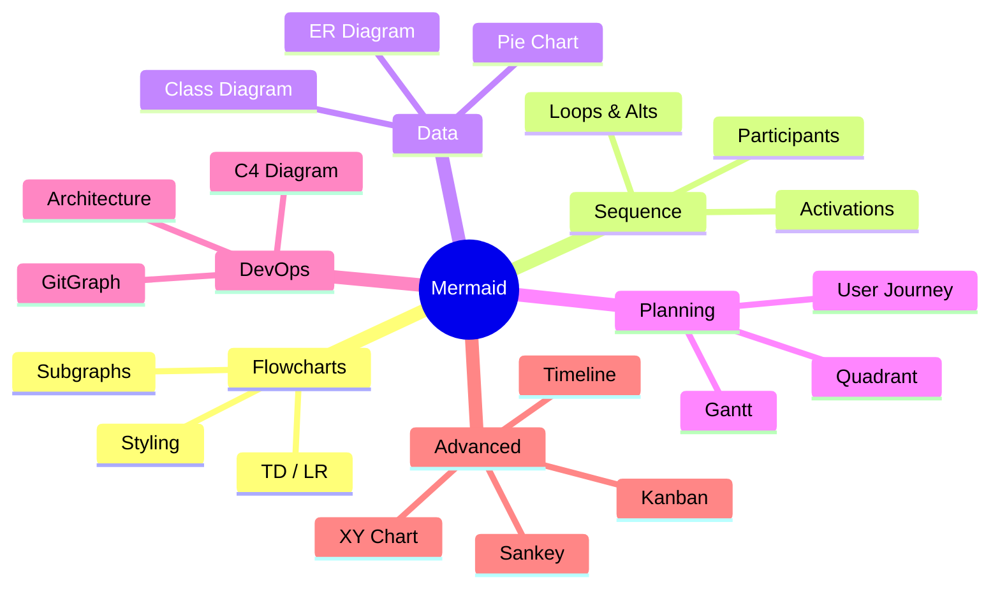
```mermaid
mindmap
  root((Mermaid))
    Flowcharts
      TD / LR
      Subgraphs
      Styling
    Sequence
      Participants
      Activations
      Loops & Alts
    Data
      ER Diagram
      Class Diagram
      Pie Chart
    Planning
      Gantt
      User Journey
      Quadrant
    DevOps
      GitGraph
      C4 Diagram
      Architecture
    Advanced
      Sankey
      XY Chart
      Timeline
      Kanban
```

## 14. Timeline

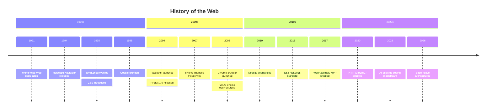
```mermaid
timeline
    title History of the Web
    section 1990s
        1991 : World Wide Web goes public
        1994 : Netscape Navigator released
        1995 : JavaScript invented
             : CSS introduced
        1998 : Google founded
    section 2000s
        2004 : Facebook launched
             : Firefox 1.0 released
        2007 : iPhone changes mobile web
        2008 : Chrome browser launched
             : V8 JS engine open-sourced
    section 2010s
        2010 : Node.js popularised
        2015 : ES6 / ES2015 standard
        2017 : WebAssembly MVP shipped
    section 2020s
        2020 : HTTP/3 (QUIC) adopted
        2023 : AI-assisted coding mainstream
        2026 : Edge-native architectures
```

## 15. Sankey Diagram

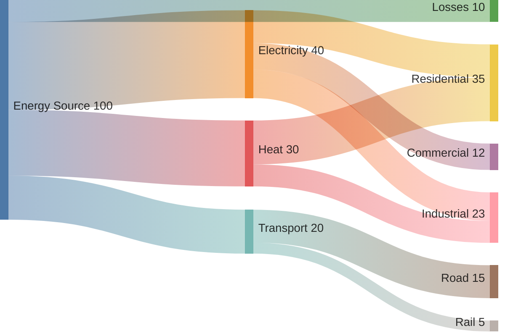
```mermaid
sankey-beta
    Energy Source,Electricity,40
    Energy Source,Heat,30
    Energy Source,Transport,20
    Energy Source,Losses,10
    Electricity,Residential,15
    Electricity,Commercial,12
    Electricity,Industrial,13
    Heat,Residential,20
    Heat,Industrial,10
    Transport,Road,15
    Transport,Rail,5
```

## 16. XY Chart

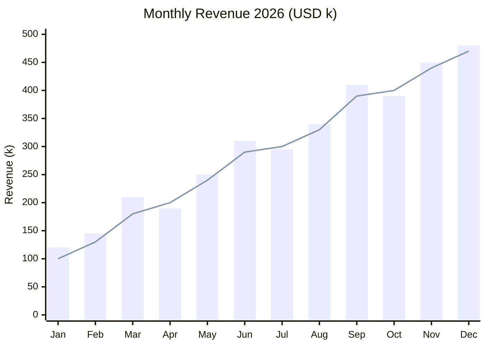
```mermaid
xychart-beta
    title "Monthly Revenue 2026 (USD k)"
    x-axis [Jan, Feb, Mar, Apr, May, Jun, Jul, Aug, Sep, Oct, Nov, Dec]
    y-axis "Revenue (k)" 0 --> 500
    bar  [120, 145, 210, 190, 250, 310, 295, 340, 410, 390, 450, 480]
    line [100, 130, 180, 200, 240, 290, 300, 330, 390, 400, 440, 470]
```

## 17. Block Diagram

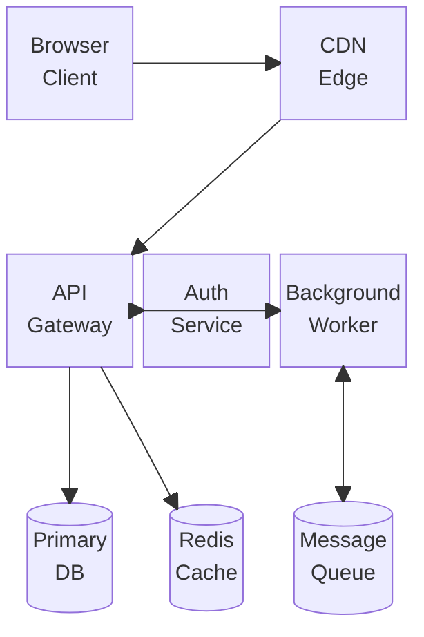
```mermaid
block-beta
    columns 3

    Client["Browser\nClient"]:1
    space:1
    CDN["CDN\nEdge"]:1

    space:3

    API["API\nGateway"]:1
    Auth["Auth\nService"]:1
    Worker["Background\nWorker"]:1

    space:3

    DB[("Primary\nDB")]:1
    Cache[("Redis\nCache")]:1
    Queue[("Message\nQueue")]:1

    Client --> CDN
    CDN --> API
    API --> Auth
    API --> Worker
    API --> DB
    API --> Cache
    Worker --> Queue
    Queue --> Worker
```

## 18. C4 Context Diagram

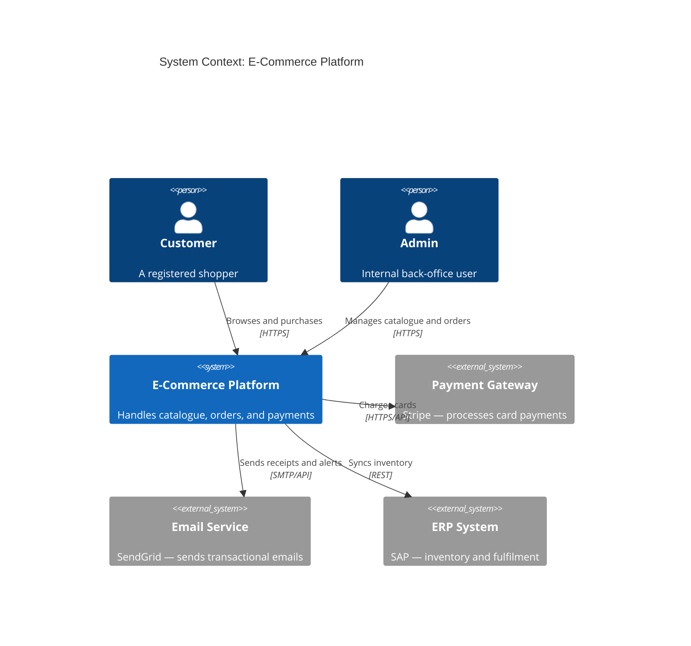
```mermaid
C4Context
    title System Context: E-Commerce Platform

    Person(customer, "Customer", "A registered shopper")
    Person(admin, "Admin", "Internal back-office user")

    System(shop, "E-Commerce Platform", "Handles catalogue, orders, and payments")

    System_Ext(payment, "Payment Gateway", "Stripe — processes card payments")
    System_Ext(email, "Email Service", "SendGrid — sends transactional emails")
    System_Ext(erp, "ERP System", "SAP — inventory and fulfilment")

    Rel(customer, shop, "Browses and purchases", "HTTPS")
    Rel(admin, shop, "Manages catalogue and orders", "HTTPS")
    Rel(shop, payment, "Charges cards", "HTTPS/API")
    Rel(shop, email, "Sends receipts and alerts", "SMTP/API")
    Rel(shop, erp, "Syncs inventory", "REST")
```

## 19. Kanban

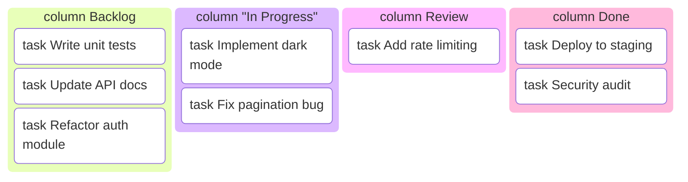
```mermaid
kanban
    column Backlog
        task Write unit tests
        task Update API docs
        task Refactor auth module
    column "In Progress"
        task Implement dark mode
        task Fix pagination bug
    column Review
        task Add rate limiting
    column Done
        task Deploy to staging
        task Security audit
```

## 20. Architecture Diagram

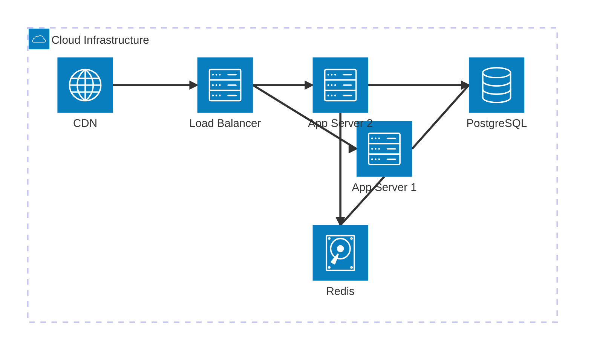
```mermaid
architecture-beta
    group cloud(cloud)[Cloud Infrastructure]

    service cdn(internet)[CDN] in cloud
    service lb(server)[Load Balancer] in cloud
    service app1(server)[App Server 1] in cloud
    service app2(server)[App Server 2] in cloud
    service db(database)[PostgreSQL] in cloud
    service cache(disk)[Redis] in cloud

    cdn:R --> L:lb
    lb:R --> L:app1
    lb:R --> L:app2
    app1:R --> L:db
    app2:R --> L:db
    app1:B --> T:cache
    app2:B --> T:cache
```
