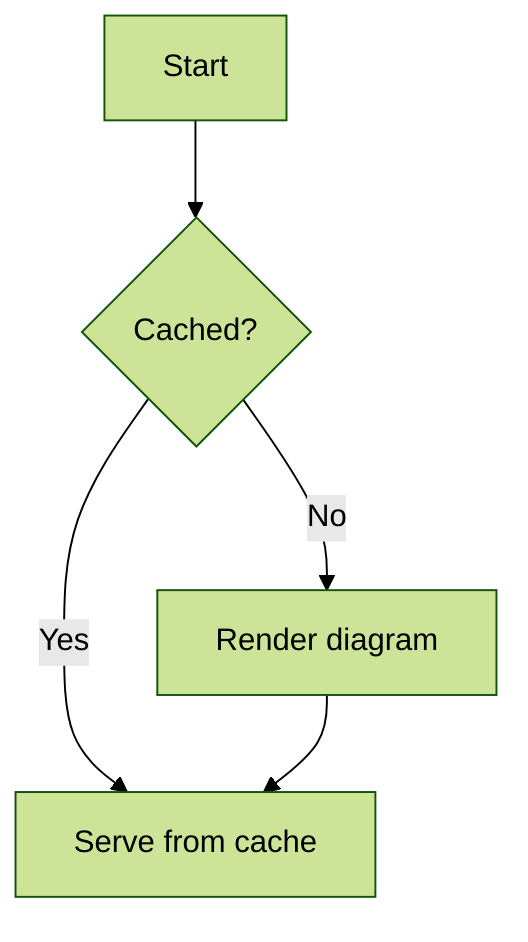
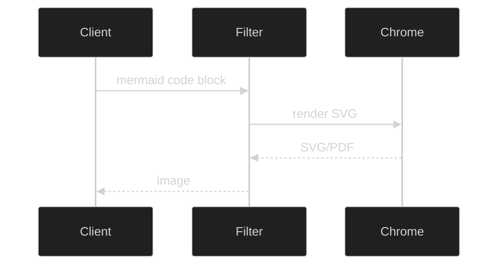
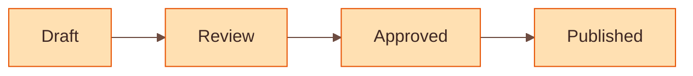
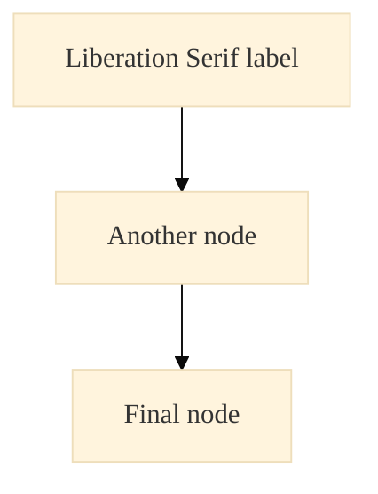
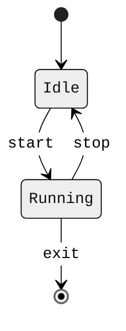

# Mermaid custom themes and fonts

This test exercises mermaid theming and font overrides applied per-diagram via the
`%%{init}%%` directive, which mermaid parses at render time regardless of the
`mermaid-filter` configuration.

## Built-in theme: forest

## Built-in theme: dark

## Custom colors via base theme + themeVariables

Custom `themeVariables` only take effect with `theme: "base"`.

## Custom font via themeVariables.fontFamily

The font must exist inside the container. The image ships `fonts-liberation`, so
`Liberation Serif` resolves; the generic `monospace` family is also exercised.

